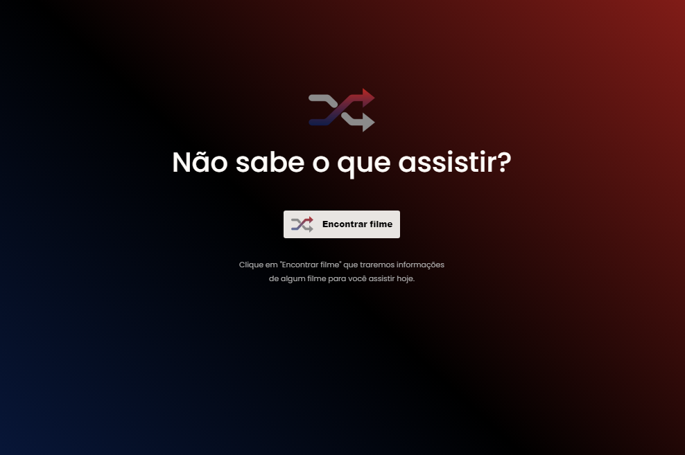

<h1 align="center">
  🎬 Rocketflix
</h1>

  

<h4 align="center"><a href="https://rocketflix-hazel.vercel.app/">Clique para visitar o projeto</a></h4>

## 📚 Sobre o projeto

Desafio proposto pelo curso <strong>Discover da Rocketseat.</strong> Neste desafio eu utilizei a API do themoviedb.org para exibir um filme aleatório sempre que o usuário clicar em "Encontrar filme". 🚀

## ⚙️ Funcionalidade

☑︎ Exibir filmes aleatórios sempre que clicar no botão.

## 🛠️ Tecnologias utilizadas

- HTML
- CSS
- JavaScript
- Axios
- Animation CSS
